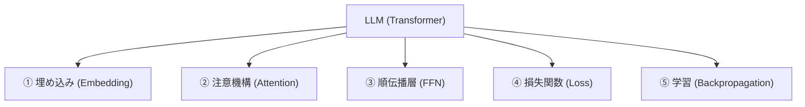
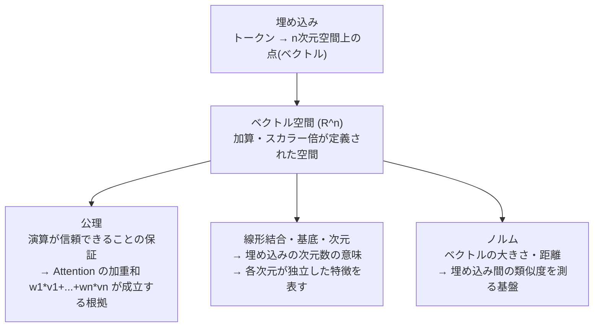
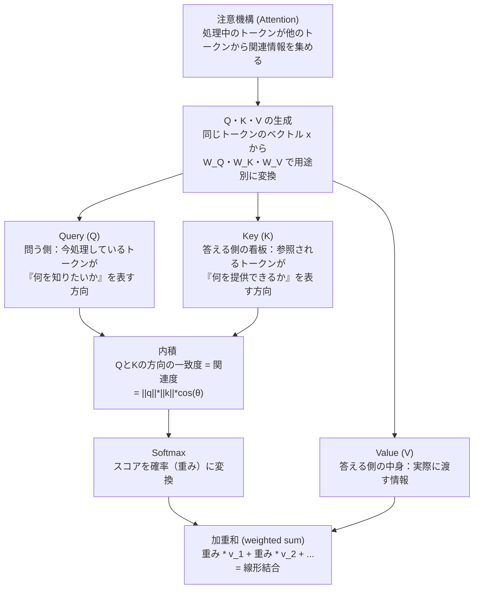

# LLM → 数学 マップ

LLM を構成する概念と、それが依拠する数学の対応図。
学習を進めながら徐々に詳細を追記していく。

---

## 全体像

---

## ① 埋め込み（Embedding）

---

## ② 注意機構（Attention）

#### 使われる数学

| 要素 | 数学 |
|---|---|
| Q・K・V の生成 | 行列・線形写像 |
| `<q, k>` | 内積（= ノルム × cos θ） |
| `/sqrt(d)` によるスケーリング | ノルム（分散の安定化） |
| Softmax | 指数関数・確率の正規化 |
| 加重和 | 線形結合 |

---

## ③ 順伝播層（FFN）

*学習中*

---

## ④ 損失関数（Loss）

*学習中*

---

## ⑤ 学習（Backpropagation）

*学習中*
