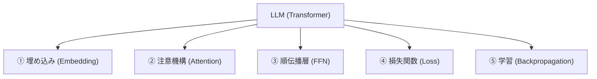
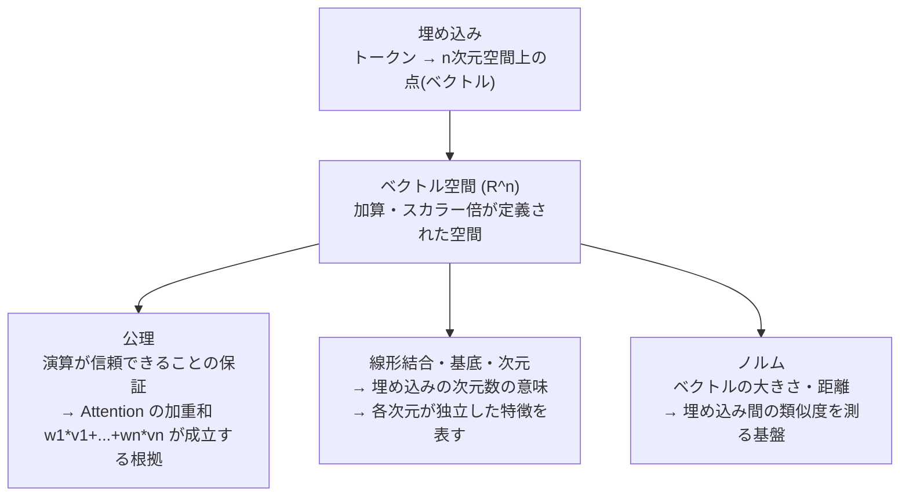
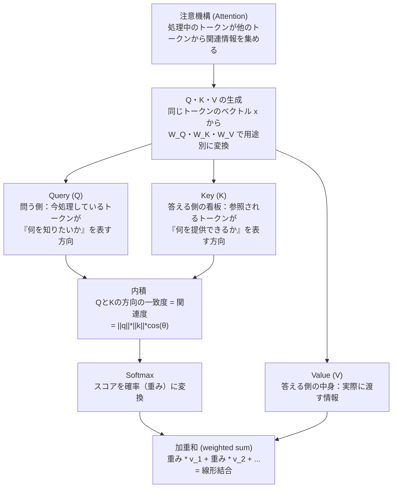
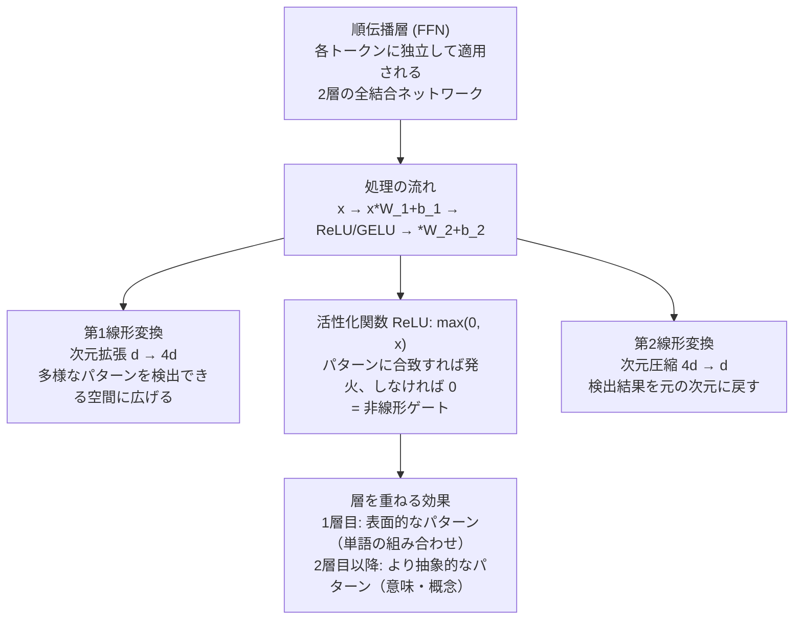

# LLM → 数学 マップ

LLM を構成する概念と、それが依拠する数学の対応図。
学習を進めながら徐々に詳細を追記していく。

---

## 全体像

---

## ① 埋め込み（Embedding）

トークンを数値ベクトルとして表現し、加算・内積・線形変換などの数学的操作が適用できる空間に写す。

---

## ② 注意機構（Attention）

処理中のトークンが、文中の他のトークンとの関連度に応じて情報を選択・収集する。

### 使われる数学

| 要素 | 数学 |
|---|---|
| Q・K・V の生成 | 行列・線形写像 |
| `<q, k>` | 内積（= ノルム × cos θ） |
| `/sqrt(d)` によるスケーリング | ノルム（分散の安定化） |
| Softmax | 指数関数・確率の正規化 |
| 加重和 | 線形結合 |

---

## ③ 順伝播層（FFN）

Attention が「どの情報を混ぜるか」を決める（線形）のに対し、FFN は「混ぜた情報がどのパターンか」を変換する（非線形）。

### 使われる数学

| 要素 | 数学 |
|---|---|
| W_1, W_2 による変換 | 行列・線形写像 |
| バイアス b の加算 | アフィン写像（線形写像 + 定数項） |
| ReLU / GELU | 非線形関数 |
| 2層の合成 | 写像の合成 |

---

## ④ 損失関数（Loss）

*学習中*

---

## ⑤ 学習（Backpropagation）

*学習中*
