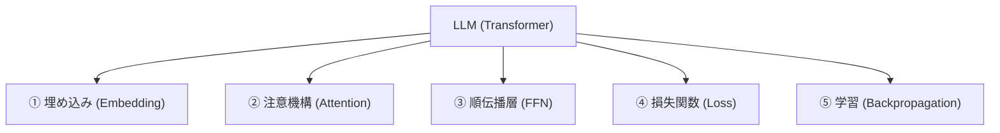
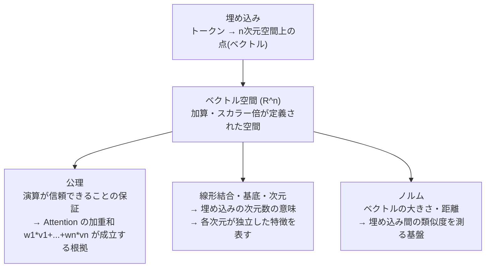

# LLM → 数学 マップ

LLM を構成する概念と、それが依拠する数学の対応図。
学習を進めながら徐々に詳細を追記していく。

---

## 全体像

---

## ① 埋め込み（Embedding）

---

## ② 注意機構（Attention）

*学習中*

---

## ③ 順伝播層（FFN）

*学習中*

---

## ④ 損失関数（Loss）

*学習中*

---

## ⑤ 学習（Backpropagation）

*学習中*
